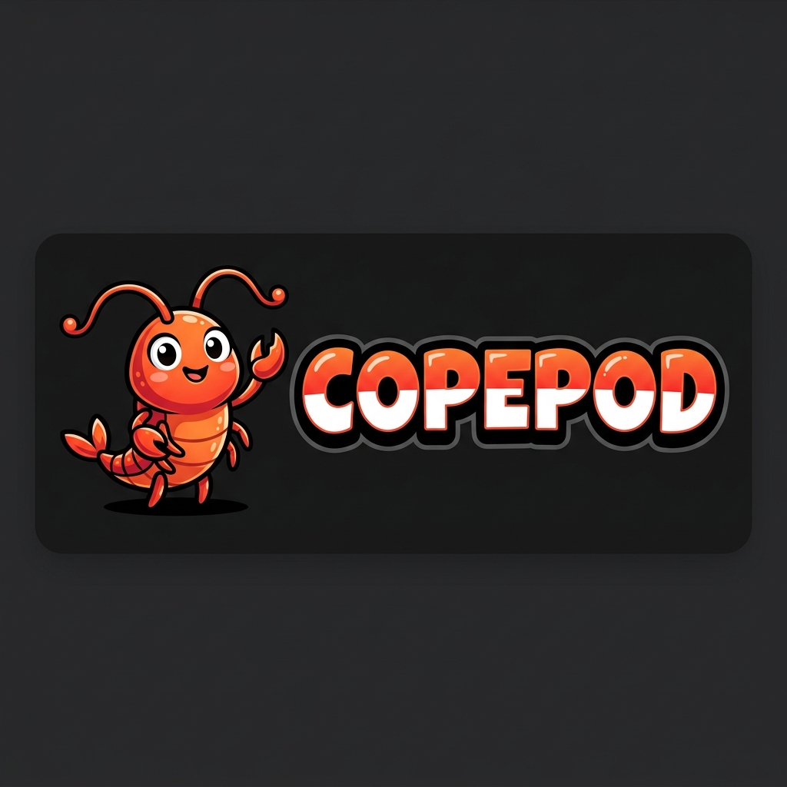

# 🦐 Copepod — The Institutional Memory Layer for GitHub Repositories

<p align="center">
  
</p>

<p align="center">
  <strong>DIGEST! REMEMBER! RECALL!</strong>
</p>

<p align="center">
  <a href="https://github.com/topoteretes/cognee"></a>
  
  
  
</p>

**Copepod** is the _institutional memory layer_ for GitHub repositories, powered by [Cognee](https://github.com/topoteretes/cognee). 

Every engineering team accumulates invisible context over time—why a bug-like line is actually a critical workaround, or why a simple approach was rejected. When developers leave or production breaks at 2 AM, this context vanishes. **Copepod solves developer amnesia.** 

It ingests your repository's entire history (PRs, issues, AST code structure), builds a semantic knowledge graph using Cognee, and exposes it through three intuitive interfaces: a **Web Studio**, an **MCP Server**, and an interactive **VS Code Graph Sidebar**.

---

[Web Studio](studio) · [FastAPI Backend](backend) · [MCP Server](mcp-server) · [VS Code Extension](vscode-extension) · [Docs](docs) · [Cognee Engine](https://github.com/topoteretes/cognee)

New install? Start here: [Docker Quick Start](#-docker-quick-start-one-command) or run the setup locally with `docker compose up --build`.

---

## 🛠️ Core Technology Stack

<table align="center">
  <tr>
    <td align="center" width="16.66%">
      <a href="https://github.com/topoteretes/cognee">
        
        <br><sub>Cognee</sub>
      </a>
    </td>
    <td align="center" width="16.66%">
      <a href="https://fastapi.tiangolo.com/">
        
        <br><sub>FastAPI</sub>
      </a>
    </td>
    <td align="center" width="16.66%">
      <a href="https://nextjs.org/">
        
        <br><sub>Next.js</sub>
      </a>
    </td>
    <td align="center" width="16.66%">
      <a href="https://code.visualstudio.com/">
        
        <br><sub>VS Code</sub>
      </a>
    </td>
    <td align="center" width="16.66%">
      <a href="https://www.python.org/">
        
        <br><sub>Python</sub>
      </a>
    </td>
    <td align="center" width="16.66%">
      <a href="https://www.docker.com/">
        
        <br><sub>Docker</sub>
      </a>
    </td>
  </tr>
</table>

---

## 🐳 Docker Quick Start (One Command)

Deploy the entire stack (FastAPI Backend + SQLite + Cognee DBs + Studio Web UI) locally in a single command:

```bash
# 1. Clone the project
git clone https://github.com/your-org/copepod.git
cd copepod

# 2. Configure credentials
cp backend/.env.example backend/.env
# Open backend/.env and populate your GITHUB_CLIENT_ID, GITHUB_CLIENT_SECRET, and GROQ_API_KEY.

# 3. Launch with Docker Compose
docker compose up --build
```

* **Web Studio**: Access at `http://localhost:3000`
* **FastAPI Backend Docs**: Access at `http://localhost:8000/docs`

*To include the MCP server in your compose stack, run:*
```bash
docker compose --profile mcp up --build
```

---

## ⚡ Key Surfaces

* **🖥️ Web Studio (Next.js)**: A Next.js frontend built with a minimalist, grid-based engineering blueprint aesthetic. Track repository ingestion progress in real-time using Server-Sent Events (SSE), chat with your repository's history, and view source citations linking answers back to PR numbers, issues, or code symbols.
* **🔌 MCP Bridge (Model Context Protocol)**: Exposes the repository's institutional memory directly to your local AI coding assistants (like Claude Code, Cursor, Cline, or Copilot). Features tools like `ask(question)` and `file_context(file_path)` to query decision history before rewriting code.
* **📐 VS Code Extension (Decision Graph)**: A custom sidebar containing an interactive SVG-based node hierarchy graph. Includes auto-detection of the active repository, visual traces connecting files to PRs and issues, and a Code Trust Scorer (0.0 - 1.0) calculating code stability based on commit recency and regression history.

---

## Highlights

* **🧠 Cognitive Memory Lifecycle** — Full structured lifecycle operations using Cognee's `remember()`, `recall()`, `improve()`, and `forget()` mechanisms.
* **🔒 Isolated Datasets** — Deterministic namespace mapping (`copepod_{user_id}_{owner}_{repo}`) to ensure strict data separation per repository.
* **⚙️ Zero-Cost Embedded DBs** — Runs local, embedded KuzuDB (graph) and LanceDB (vector) instances requiring $0 infrastructure cost.
* **🧩 Python AST Parser** — Extracts functions, classes, decorators, docstrings, and call-graphs as declarative memory statements automatically.
* **⚡ Granular Payload Formatter** — Converts raw GitHub webhook and API JSON payloads into structured English sentences for high entity-extraction accuracy.

---

## 🧠 Cognee Memory Lifecycle

Copepod implements a complete memory lifecycle using Cognee's four core operations:

```
                  ┌───────────────────────────────┐
                  │           REMEMBER            │
                  │   Ingest PRs, Issues, AST    │
                  └───────────────┬───────────────┘
                                  │
                                  ▼
 ┌───────────────┐        ┌───────────────┐        ┌───────────────┐
  │    IMPROVE    │◄───────┤    RECALL     ├───────►│    FORGET     │
  │ Reinforce on  │        │ Ask Studio,   │        │ Prune deleted │
  │  merged PRs   │        │  MCP, VS Code │        │  files/repos  │
  └───────────────┘        └───────────────┘        └───────────────┘
```

1. **`remember()` (Ingestion)**: Triggers during initial repository setup and incremental GitHub webhook events (PR merges, issue closures).
2. **`recall()` (Retrieval)**: Executes during search and chat queries from the Web Studio, VS Code Sidebar, MCP tools, and automated triage.
3. **`improve()` (Refinement)**: Triggers when a pull request referencing Copepod context is successfully merged. It validates that the recalled context was accurate, reinforcing the knowledge graph.
4. **`forget()` (Pruning)**: Cleans up memory when a repository is disconnected or when file deletion events are received via push webhooks.

---

## 🏗️ Architecture & Zero-Cost Infrastructure

Copepod runs entirely self-hosted:

```
                       ┌───────────────────────┐
                       │  VS Code / MCP / Web  │
                       └───────────┬───────────┘
                                   │ HTTPS (X-API-Key / JWT)
                                   ▼
                       ┌───────────────────────┐
                       │   FastAPI Backend     │
                       └───────────┬───────────┘
                                   │
                    ┌──────────────┴──────────────┐
                    ▼                             ▼
       ┌─────────────────────────┐   ┌─────────────────────────┐
       │     GitHub Webhooks     │   │      Cognee Engine      │
       │   Delta updates &       │   │   Isolated datasets     │
       │   Automated Triage      │   │   per repository        │
       └─────────────────────────┘   └────────────┬────────────┘
                                                  │
                ┌────────────────┬────────────────┬───────────────┐
                ▼                ▼                ▼               ▼
         ┌─────────────┐  ┌─────────────┐  ┌─────────────┐ ┌─────────────┐
         │  LiteLLM /  │  │  fastembed  │  │   KuzuDB    │ │  LanceDB    │
         │  Groq API   │  │ (Local CPU) │  │  (Graph DB) │ │ (Vector DB) │
         │ (Free LLM)  │  │ (Embeddings)│  │ (Embedded)  │ │ (Embedded)  │
         └─────────────┘  └─────────────┘  └─────────────┘ └─────────────┘
```

* **Embedded DBs**: Utilizes local KuzuDB and LanceDB inside the container.
* **Python AST Parser**: Parses files syntax-by-syntax (`app/services/code_parser.py`) to map codebase relationships.
* **Payload Formatter**: Translates webhook JSONs to semantic statements (`app/services/formatter.py`).

---

## 🛠️ Local Development Setup

If you prefer to run components individually outside of Docker:

### 1. Prerequisite: GitHub OAuth App
1. Go to your GitHub profile → **Settings** → **Developer Settings** → **OAuth Apps** → **New OAuth App**.
2. Set **Homepage URL** to `http://localhost:3000`.
3. Set **Authorization callback URL** to `http://localhost:8000/auth/github/callback`.
4. Copy the **Client ID** and generate a **Client Secret**.

### 2. Backend Installation (Python 3.11+)
```bash
cd backend
python -m venv .venv
source .venv/bin/activate  # On Windows: .venv\Scripts\activate

# Install package in editable mode
pip install -e .

# Run migrations/startup tables and launch server
uvicorn app.main:app --reload --port 8000
```

### 3. Studio Web UI Installation (Node 18+)
```bash
cd studio
npm install
npm run dev
# The website will spin up at http://localhost:3000
```

### 4. VS Code Extension Installation
1. Open the `vscode-extension` directory in VS Code.
2. Run `npm install` inside the extension directory.
3. Compile the TypeScript: `npm run compile`.
4. Press `F5` to open a new **Extension Development Host** window.
5. In VS Code Settings, configure:
   * `copepod.apiKey`: Obtain this API key from the Web Studio's profile settings.
   * `copepod.repoId`: The UUID of the repository created in the Studio database.

---

## ⚙️ MCP Server Configuration

Add the Copepod MCP server to your local desktop agent (e.g., Claude Desktop) by editing your configuration file:

* **Location (MacOS/Linux)**: `~/Library/Application Support/Claude/claude_desktop_config.json`
* **Location (Windows)**: `%APPDATA%\Claude\claude_desktop_config.json`

Add this entry to your config:

```json
{
  "mcpServers": {
    "copepod": {
      "command": "python",
      "args": [
        "-m",
        "copepod_mcp.server"
      ],
      "env": {
        "COPEPOD_CONFIG": "/absolute/path/to/your/project/.copepod/config.json"
      }
    }
  }
}
```

Where `.copepod/config.json` inside your project root contains:
```json
{
  "api_url": "http://localhost:8000",
  "api_key": "your-copepod-api-key",
  "repo_id": "your-repo-uuid"
}
```

---

## 🦐 Copey

Copepod was built for **Copey**, a digital space shrimp AI assistant. 🦐
by the community.

---

## 🤝 Contributing

Contributions are what make the open-source community an amazing place to learn, inspire, and create.
1. Fork the Project.
2. Create your Feature Branch (`git checkout -b feature/AmazingFeature`).
3. Commit your Changes (`git commit -m 'Add some AmazingFeature'`).
4. Push to the Branch (`git push origin feature/AmazingFeature`).
5. Open a Pull Request.

AI/vibe-coded PRs welcome! 🤖

---

## 📄 License

This project is licensed under the MIT License - see the [LICENSE](LICENSE) file for details.

---

<p align="center">
  Built with 💜 using <a href="https://github.com/topoteretes/cognee">Cognee</a> for the Cognee Hackathon 🧠
</p>
